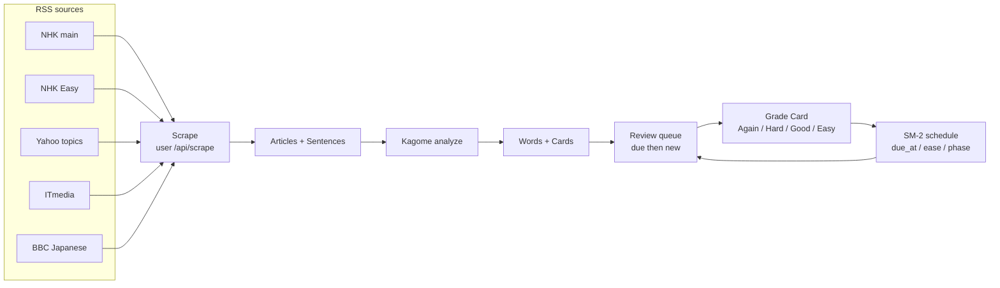
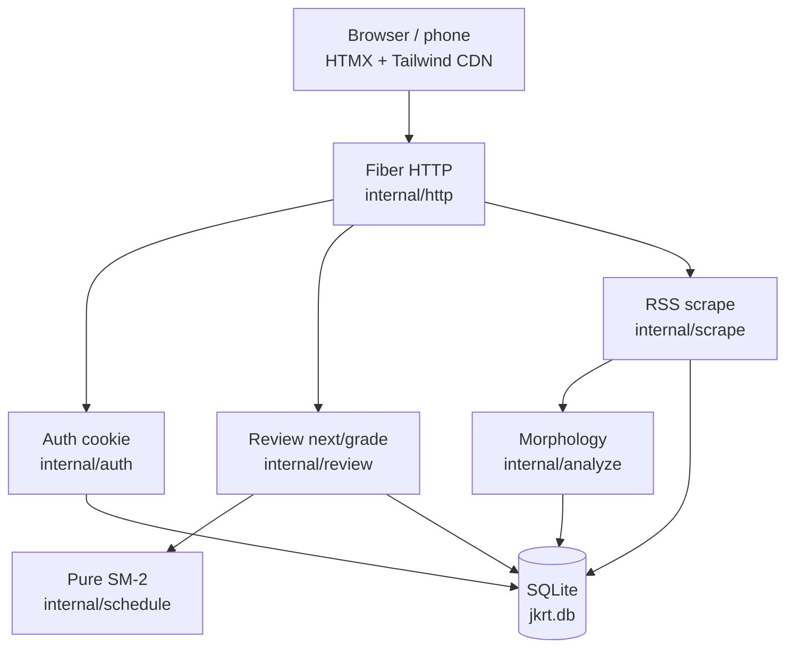
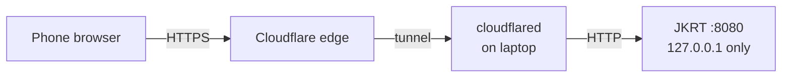
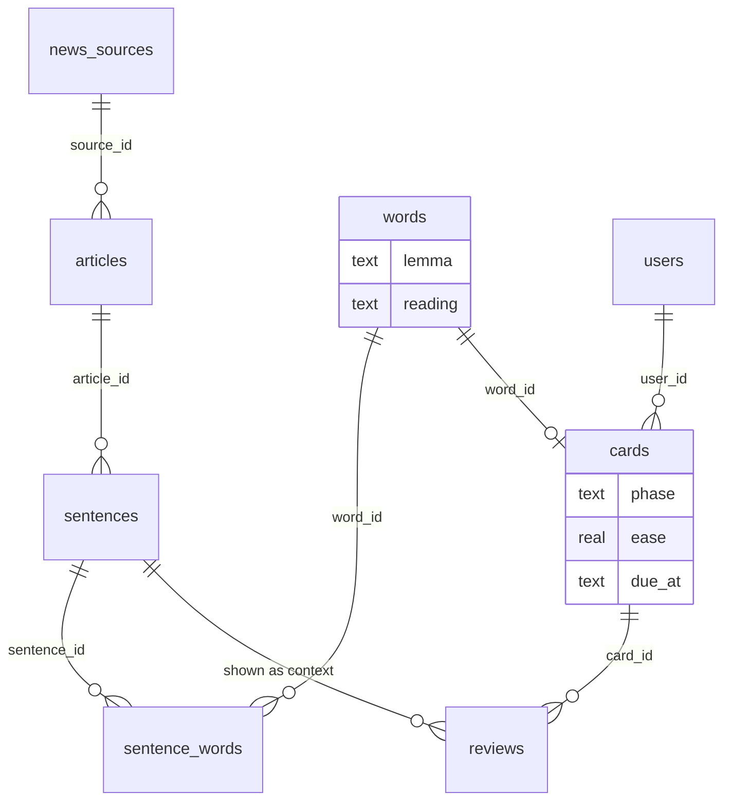

# Japanese Kanji Reading Trainer (JKRT)

Personal web app for **N2 → N1 reading**: pull **Japanese news RSS** (NHK, Yahoo topics, ITmedia, BBC Japanese, …), extract **words** (lemma + reading), and review them with **Anki-like SM-2** scheduling in real sentence context.

> **Status:** Phase 6 complete — stats, export, performance (v1 phases 0–6 done).  
> See [`DEVELOPMENT_PLAN.md`](DEVELOPMENT_PLAN.md) and [`CONTEXT.md`](CONTEXT.md).  
> Architecture: pure `schedule` + deep `review` ([ADR 0005](docs/adr/0005-pure-schedule-deep-review.md)).  
> Ops: [Auth, cookies, Cloudflare Tunnel](docs/auth-and-tunnel.md) (full step-by-step).

| You want… | Go here |
|-----------|---------|
| Run it locally in 5 minutes | [Quick start](#quick-start-beginner-local-only) |
| Map of folders / packages | [Repository map](#repository-map) |
| How data moves (scrape → review) | [How it works](#how-it-works) |
| Domain words (Word, Card, …) | [Domain model](#domain-model-at-a-glance) |
| Phone over HTTPS | [Cloudflare Tunnel](#access-from-your-phone-cloudflare-tunnel) · [full guide](docs/auth-and-tunnel.md) |
| Scheduler math | [`docs/sm2-spec.md`](docs/sm2-spec.md) |
| Schema / HTTP / phases | [`DEVELOPMENT_PLAN.md`](DEVELOPMENT_PLAN.md) |

---

## How it works

### Learning loop (end-to-end)

You do **not** grade whole articles or single kanji. The app scrapes news RSS, splits text into **Sentences**, finds kanji-bearing **Words** (lemma + reading), creates a **Card** per Word, then you grade **one Card at a time** in sentence context.



### Built-in RSS sources

One **Scrape** always pulls **all** of these (partial success per feed is OK). URLs for Yahoo / ITmedia / BBC are hardcoded like NHK main; only NHK main/easy are env-overridable today.

| `name` | Default URL | Notes |
|--------|-------------|--------|
| `nhk_main` | `https://news.web.nhk/n-data/conf/na/rss/cat0.xml` | Override: `JKRT_NHK_MAIN_RSS_URL` |
| `nhk_easy` | *(empty)* | Set `JKRT_NHK_EASY_RSS_URL` when you have a live Easy RSS |
| `yahoo_topics` | `https://news.yahoo.co.jp/rss/topics/top-picks.xml` | Major topics; often title-heavy |
| `itmedia_news` | `https://rss.itmedia.co.jp/rss/2.0/news_bursts.xml` | Tech news (JA) |
| `bbc_japanese` | `https://feeds.bbci.co.uk/japanese/rss.xml` | BBC News 日本語 |

To add another feed later: append a `Source` in `internal/scrape.DefaultSources` (stable name + public RSS 2.0 URL). Still **no HTML article scrape**.

### Runtime stack



### What you grade vs what you see

| UI shows | You grade | Scheduler updates |
|----------|-----------|-------------------|
| One **Sentence** with the focus Word highlighted | That Word’s **Card** only | That Card’s phase / interval / ease / `due_at` |
| Other unfamiliar words may be highlighted | Not graded in this step | Unchanged |
| Furigana (optional toggle; off by default) | Reading skill, not a separate grade | — |

### Deploy modes

```text
Local only                          Phone / remote
─────────                          ──────────────
make run-dev                       make run-auth          (JKRT_AUTH=on)
JKRT_AUTH=off                      cloudflared ──────────► Cloudflare HTTPS
browser → http://localhost:8080    phone → https://your-host…
                                   never tunnel with auth off
```



---

## Domain model (at a glance)

Full glossary: [`CONTEXT.md`](CONTEXT.md).

| Term | Meaning in JKRT |
|------|-----------------|
| **Source** | Configured RSS feed (built-in multi-publisher list) |
| **Article** | One RSS item stored as text |
| **Sentence** | Clause/unit of article text used as review context |
| **Token** | Raw analyzer unit for a span of a Sentence |
| **Word** | Learning unit = **lemma + reading** (not surface form alone) |
| **Card** | Schedulable SM-2 state for one Word for the Learner |
| **Review** | One grade on one Card, shown in a Sentence |
| **Unfamiliar Word** | Highlighted in context (new/learning/due/short interval) — still graded one at a time |

### Data relationships (SQLite)

Tables live in `migrations/001_init.sql` (+ indexes in `002_perf.sql`).



| Stage | Tables | Package |
|-------|--------|---------|
| Ingest | `news_sources`, `articles`, `sentences` | `scrape` → `db` |
| Extract | `words`, `sentence_words`, `cards` | `analyze` + `db` extract |
| Study | `cards` queue + `reviews` history | `review` + pure `schedule` |
| Snapshot | all of the above via export | `export` / `snapshot` |

### Grades (Review result)

| Grade | Intent (short) | Spec |
|-------|----------------|------|
| **Again** | Forgot — back through learning / lapse | [`docs/sm2-spec.md`](docs/sm2-spec.md) |
| **Hard** | Remembered with difficulty | same |
| **Good** | Normal pass (default success path) | same |
| **Easy** | Too easy — longer interval | same |

---

## Repository map

```text
jkrt/
├── cmd/
│   ├── server/          # HTTP process entrypoint
│   └── setpassword/     # rotate login password (no Card wipe)
├── internal/
│   ├── http/            # Fiber routes, HTML/HTMX handlers
│   ├── auth/            # bcrypt password, HMAC session cookie
│   ├── config/          # JKRT_* env loading
│   ├── scrape/          # multi-source RSS fetch + parse
│   ├── analyze/         # Kagome (IPA) → word candidates
│   ├── schedule/        # pure SM-2 math (no I/O)
│   ├── review/          # next/grade + stats (uses DB + schedule)
│   ├── db/              # SQLite open, migrations, extract, browse
│   ├── export/          # JSON/CSV download builders
│   └── snapshot/        # full-data snapshot types
├── migrations/          # SQL applied on startup
├── web/static/          # static assets / shell HTML
├── testdata/            # RSS + analyze fixtures (no network in tests)
├── docs/                # sm2-spec, auth-and-tunnel, ADRs
├── Makefile             # run-dev, run-auth, test, tunnel-quick, …
├── CONTEXT.md           # domain language
└── DEVELOPMENT_PLAN.md  # schema, HTTP surface, phases
```

| Package | Responsibility | Depends on I/O? |
|---------|----------------|-----------------|
| `internal/schedule` | SM-2 state transitions, unfamiliar rule | **No** (pure; heavy unit tests) |
| `internal/analyze` | Tokenize Japanese → lemma/reading candidates | Dict in process; tests use fixtures |
| `internal/scrape` | Fetch/parse RSS → articles | Network only when you scrape live |
| `internal/review` | Pick next Card, apply grade, stats | **Yes** (SQLite) |
| `internal/http` | Routes, login, HTMX pages, API | Yes |
| `internal/auth` | Bootstrap user, cookie sessions | Yes |
| `internal/db` | Migrations, extract, browse counts | Yes |
| `internal/export` | Downloadable dump of library/cards | Yes |

### Docs map

| File | Role |
|------|------|
| [`CONTEXT.md`](CONTEXT.md) | Domain glossary (Word, Card, Scrape, …) |
| [`DEVELOPMENT_PLAN.md`](DEVELOPMENT_PLAN.md) | Phases, schema, HTTP, acceptance |
| [`docs/sm2-spec.md`](docs/sm2-spec.md) | SM-2 scheduler (normative) |
| [`docs/auth-and-tunnel.md`](docs/auth-and-tunnel.md) | Cookie/TTL, password rotate, **full Cloudflare guide** |
| [`docs/adr/`](docs/adr/) | Architecture decisions |
| [`AGENTS.md`](AGENTS.md) | Agent workflow + conventions |
| [`.env.example`](.env.example) | Environment variable template |

---

## Features

- [x] Local Go server with password auth (HMAC session cookie)
- [x] Morphological analysis → kanji-bearing **Words** + Card rows
- [x] User-triggered scrape of **all** built-in RSS feeds (NHK + others; no HTML page scrape)
- [x] Review one Word at a time (Again / Hard / Good / Easy) with SM-2 scheduling
- [x] Sentence context with unfamiliar words highlighted; furigana on toggle (default off)
- [x] Dashboard / browse polish
- [x] Auth harden + password rotate + tunnel guide
- [x] Stats API, JSON/CSV export, indexes + size limits

## Tech

| Layer | Choice |
|-------|--------|
| Backend | Go + Fiber |
| DB | SQLite (`modernc.org/sqlite`) |
| Analyzer | Kagome v2 + IPA dict (pure Go) |
| Frontend | HTMX + Tailwind CDN · Noto Sans JP |
| Schedule | SM-2-ish ([spec](docs/sm2-spec.md); not Anki sync / FSRS) |
| Deploy | Local + cloudflared (**auth on**) |

---

## Requirements

You need a terminal and:

| Tool | Why | Check |
|------|-----|--------|
| **Go 1.25+** | Build and run the server | `go version` |
| **Git** | Clone the repo | `git --version` |
| **curl** (optional) | Health check / scrape from CLI | `curl --version` |
| **openssl** (optional) | Generate session secrets | `openssl version` |
| **make** (optional) | Short commands below | `make help` |
| **cloudflared** (phone only) | HTTPS tunnel to your laptop | See [Cloudflare guide](docs/auth-and-tunnel.md) |

Install Go from [https://go.dev/dl/](https://go.dev/dl/) if `go version` is missing or older than 1.25.

**Network:** only needed to download Go modules (first build) and to **scrape** live NHK RSS. Unit tests never hit the network.

---

## Quick start (beginner, local only)

These steps assume you have never run JKRT before. They leave **auth off** so you can open the browser without a password. Use this **only on your own machine**. For phone / public URL, jump to [Access from your phone](#access-from-your-phone-cloudflare-tunnel) after you can run locally.

### 1. Get the code

```bash
git clone https://github.com/rikiisworking/jkrt.git
cd jkrt
```

(If you already have the folder, just `cd` into it.)

### 2. Confirm Go works

```bash
go version
# need go1.25 or newer (go1.26 is fine)
```

### 3. Start the server (auth off)

**With Make (simplest):**

```bash
make run-dev
```

**Without Make:**

```bash
export JKRT_AUTH=off
go run ./cmd/server
```

First run may take a minute while Go downloads modules and the Kagome dictionary.

You should see a log line like:

```text
jkrt listening on :8080 (auth=false)
```

Leave this terminal open.

### 4. Open the app

In a browser on the same machine:

| URL | What you get |
|-----|----------------|
| [http://localhost:8080/health](http://localhost:8080/health) | `{"status":"ok"}` |
| [http://localhost:8080/](http://localhost:8080/) | Dashboard (due/new, scrape, links) |
| [http://localhost:8080/review](http://localhost:8080/review) | Next Card or empty queue |
| [http://localhost:8080/articles](http://localhost:8080/articles) | Browse Articles / Sentences |

Or from another terminal:

```bash
make health
# or: curl -sS http://127.0.0.1:8080/health
```

### 5. Pull news (optional, needs network)

On the dashboard, use the scrape control, or:

```bash
make scrape
# or: curl -sS -X POST http://127.0.0.1:8080/api/scrape
```

Needs a live network path. NHK **Easy** soft-fails until you set `JKRT_NHK_EASY_RSS_URL`. Other built-in feeds use hardcoded public URLs (see [Built-in RSS sources](#built-in-rss-sources)).

### 6. Stop the server

In the server terminal: `Ctrl+C`.

SQLite data stays in `./jkrt.db` (created automatically; do not commit it).

---

## Everyday commands (Makefile)

```bash
make help          # list targets
make env           # create .env from .env.example + random session secret
make run-dev       # local, auth off
make run-auth      # local/tunnel, auth on (loads .env)
make test          # go test ./...
make setpassword   # rotate login password
make tunnel-quick  # ephemeral Cloudflare HTTPS URL (auth must already be on)
make build         # binary → bin/jkrt
```

The app reads **environment variables** only (it does not auto-load `.env` by itself).  
`make run-auth` sources `.env` for you. Without Make, `export` the vars or `set -a && source .env && set +a` before `go run`.

---

## Run with password auth (recommended)

Default when you omit `JKRT_AUTH` is **auth on**. You then need a session secret (≥32 characters) and, on first start, a bootstrap password.

### With Make

```bash
make env                 # once: creates .env
# Edit .env: set JKRT_PASSWORD to a real password (not change-me)
make run-auth
```

Browser: [http://127.0.0.1:8080/](http://127.0.0.1:8080/) → redirects to `/login` → enter password.

### Without Make

```bash
export JKRT_AUTH=on
export JKRT_PASSWORD='your-strong-password'          # first bootstrap only
export JKRT_SESSION_SECRET="$(openssl rand -hex 32)" # keep this value
export JKRT_ADDR=127.0.0.1:8080
go run ./cmd/server
```

Save `JKRT_SESSION_SECRET` somewhere safe (e.g. `.env`). Changing it later logs everyone out.

Copy [`.env.example`](.env.example) for the full list. **Do not commit** `.env` or `*.db`.

### Rotate password later

Does not wipe Cards or Reviews:

```bash
make setpassword
# or: go run ./cmd/setpassword -db ./jkrt.db
```

To invalidate all sessions: set a new `JKRT_SESSION_SECRET` and restart. Details: [`docs/auth-and-tunnel.md`](docs/auth-and-tunnel.md).

---

## Access from your phone (Cloudflare Tunnel)

**Never run a tunnel with `JKRT_AUTH=off`.**

Short version (temporary URL):

```bash
# Terminal 1 — auth ON, loopback only
make run-auth

# Terminal 2 — ephemeral HTTPS URL
make tunnel-quick
# open the https://….trycloudflare.com link on your phone → login
```

For a **stable hostname** on your domain (daily use), token-based named tunnel, optional Cloudflare Access, troubleshooting, and checklists, follow the full guide:

**→ [`docs/auth-and-tunnel.md`](docs/auth-and-tunnel.md)**

### Why a tunnel?

Your phone cannot reach `localhost` on your laptop over the internet. Cloudflare Tunnel makes an outbound connection from the laptop so Cloudflare can serve `https://your-name…` without opening router ports. JKRT still only listens on `127.0.0.1`; auth stays on.

---

## Config

| Env | Default | Notes |
|-----|---------|--------|
| `JKRT_ADDR` | `:8080` | Prefer `127.0.0.1:8080` when tunneling |
| `JKRT_DB_PATH` | `./jkrt.db` | SQLite (schema via `migrations/` on startup) |
| `JKRT_AUTH` | `on` | **`off` only for local dev — never with a tunnel** |
| `JKRT_PASSWORD` | — | Bootstrap user 1 if no row yet |
| `JKRT_SESSION_SECRET` | — | Required when auth on (≥32 bytes) |
| `JKRT_SESSION_TTL` | `168h` | Cookie + signed payload lifetime |
| `JKRT_NHK_MAIN_RSS_URL` | NHK main cat0 | Override main feed |
| `JKRT_NHK_EASY_RSS_URL` | *(empty)* | Set when a live Easy RSS is known |

### Session cookie (summary)

- Name: `jkrt_session` — HMAC-signed; **HttpOnly**, **SameSite=Lax**
- **Secure** when HTTPS / `X-Forwarded-Proto: https` (Tunnel)
- TTL: `JKRT_SESSION_TTL` (default 7 days); expired cookies → 302/401 like no cookie  

Full detail: [`docs/auth-and-tunnel.md`](docs/auth-and-tunnel.md).

### Useful routes (auth off, or after login)

| Method | Path | Auth when on | Notes |
|--------|------|--------------|--------|
| `GET` | `/health` | public | Liveness `{"status":"ok"}` |
| `GET` | `/login` | public | Login form |
| `POST` | `/login` | public | Sets `jkrt_session` cookie |
| `POST` | `/logout` | yes | Clears cookie |
| `GET` | `/` | yes | Dashboard (due/new, scrape, export) |
| `GET` | `/review` | yes | Next due/new Card HTML |
| `POST` | `/review` | yes | Grade Card → next |
| `GET` | `/articles` | yes | Browse Articles / Sentences |
| `POST` | `/api/scrape` | yes | All configured RSS sources (live network) |
| `GET` | `/api/stats` | yes | Queue + library JSON |
| `GET` | `/api/export?format=json\|csv` | yes | Snapshot / Cards CSV download |

Typical session:

```text
login → dashboard → POST scrape → GET /review → POST grade → GET /review → …
                              ↘ GET /articles
                              ↘ GET /api/export
```

---

## Tests

```bash
make test
# or: go test ./... -count=1
```

No live network in tests; RSS/analyzer fixtures live under `testdata/`.

---

## Troubleshooting

| Problem | Fix |
|---------|-----|
| `JKRT_SESSION_SECRET is required` | Auth defaults to **on**. Use `make run-dev` for local open access, or `make env` + `make run-auth`. |
| `no user exists and JKRT_PASSWORD is not set` | Set `JKRT_PASSWORD` once to create the login user, or use `make env` and edit `.env`. |
| Port already in use | Change `JKRT_ADDR`, e.g. `JKRT_ADDR=:8081 make run-dev`. |
| Empty review queue | Scrape first (`make scrape` or dashboard); new cards appear after ingest. |
| Easy feed `feed URL not configured` | Expected until `JKRT_NHK_EASY_RSS_URL` is set. |
| Phone cannot open `localhost` | Use Cloudflare Tunnel ([guide](docs/auth-and-tunnel.md)), not the laptop’s localhost URL. |
| Modules fail to download | Need network once; check proxy/firewall; retry `go run ./cmd/server`. |

---

## Safety

- User-triggered RSS only; respect feed terms.  
- Local data only; never commit secrets, `.env`, or real `*.db`.  
- Public tunnel **only** with `JKRT_AUTH=on` and a strong password.
